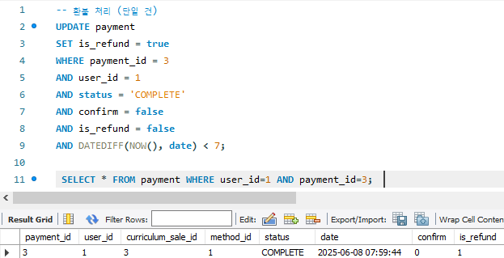
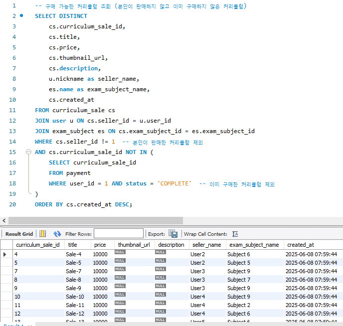
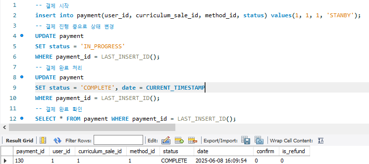

# ✅ PassMate

    

## 👥 팀원 소개
<table>
    <tr>
    <td align="center"> 김형진</td>
    <td align="center"> 정지완</td>
    <td align="center"> 김지현</td>
    <td align="center"> 윤수오</td>
  </tr>
  <tr>
    <td align="center">
    </td>
    <td align="center">
    </td>
    <td align="center"> 
    </td>
    <td align="center">
    </td>
  </tr>
</table>

## 📌 프로젝트 배경 및 필요성
현대 사회에서는 취업, 이직, 자기계발을 위한 수단으로 자격증의 중요성이 점차 커지고 있습니다. 이에 따라 다양한 분야의 자격증을 준비하는 수험생이 늘어나고 있으며, 이들은 체계적인 학습 계획, 실전 대비, 시험 정보 등의 다양한 도움을 필요로 합니다.

하지만 실제로 많은 수험생들은 다음과 같은 문제를 겪고 있습니다:

비효율적인 학습 계획: 수험생 개개인의 상황이나 시험 일정에 맞춘 효율적인 공부 계획을 세우기 어렵습니다.

학습 내용 관리 부족: 정리된 노트나 복습 자료가 체계적으로 저장되지 않아 복습의 효율이 떨어집니다.

기출/모의 문제 부족: 다양한 문제 유형을 충분히 접하지 못해 실전 감각을 키우는 데 어려움을 겪습니다.

시험 정보 접근의 불편함: 자격증 시험 일정, 장소, 변경 사항 등을 따로 검색해야 하며, 통합된 안내 시스템이 부족합니다.

자기 점검 및 분석의 부재: 본인의 학습 진척도나 성과를 구체적으로 분석할 수 있는 도구가 거의 없습니다.

PassMate는 이러한 문제를 해결하기 위해 만들어졌습니다.

## 🛠 요구사항 분석 

### 1. 👤 회원가입 및 사용자 관리
- 회원가입 및 로그인

### 2. 🙋 마이페이지
- 내 학습 계획, 노트, 퀴즈 기록 관리
- 구독 정보 및 결제 내역 확인
- 시험 결과 분석 리포트

### 3. 🔍 시험 검색
- 자격증명, 분야 등으로 검색
- 시험 일정, 접수 방법, 자격 요건 등 상세 정보 제공
- 즐겨찾기 및 알림 설정

### 4. 🔔 구독 기능 (콘텐츠 기반 학습 지원)
- **게시자(강사/합격자)**:
  - 세부 일정표 업로드 (무료/유료 선택)
  - 콘텐츠 제공 및 구독자 관리
- **구독자**:
  - 관심 게시자 구독
  - 원하는 커리큘럼을 구매해 내걸로 커스터마이징
- **결제 시스템** 연동 (카카오페이, 카드 등)

## UI 래퍼런스 참고

    
 자격증 정보 관리 

        
            

    
 커리큘럼 및 일정 관리 

        
        

    
 판매 관리 

         

    
 결제 관리 

        

## 요구사항 정의 및 명세서(SRS)

  <a href='https://docs.google.com/spreadsheets/d/1azD9ngW6ANW52FXT8A1tjiuJfzOj7GC8E5NayK5wBeg/edit?gid=1725882102#gid=1725882102' style="text-decoration: none; color: inherit;">
    요구사항 명세서
  </a>

## WBS

   

  <a href='https://docs.google.com/spreadsheets/d/1azD9ngW6ANW52FXT8A1tjiuJfzOj7GC8E5NayK5wBeg/edit?gid=688805274#gid=688805274' style="text-decoration: none; color: inherit;">
    WBS
  </a>

## ERD

   

  <a href='https://www.erdcloud.com/d/CjT9RaDnSCdBeAjtK' style="text-decoration: none; color: inherit;">
    ERD
  </a>

## Test Query

  
1. 회원가입 / 로그인

  

회원가입

    
  

  

로그인

    
    
  

  

로그아웃

  

  

회원 탈퇴

    
  

  
2. 마이페이지 (프로필)

  

내 정보 조회

    
    
  

  

내 정보 수정

    
    
  

  

정산일 설정

    
    
  

  

정산 조회

    
    
  

  

정산 처리

    
    
  

  
3. 커리큘럼

  

등록

  

수정

  

삭제

  

조회

  
4. 결제 및 구매

  

결제 수단 추가

  

결제 수단 삭제

  

환불

     구매내역 조회
    
     환불처리
    
  

  

구매 가능한 커리큘럼 조회

  

구매

  

구매 확정

     자동 확정 전
    
     자동 확정 후
    
     수동 확정 후
    
  

  

결제 내역 조회

  
5. 자격증

  

상세 정보 조회

  

생성

  

수정

    
    
    
  

  

삭제

  
6. 카테고리

  

조회

  

생성

  

수정

  

삭제

  
7. 내 일정

  

일정 생성

    
    
  

  

일정 수정

  

일정 삭제

  

카테고리 선택

  

복습 주기 / 회차 선택

  
8. To Do List

  

생성

  

수정

  

삭제

  
9. 노트

  

생성

  

수정

  

삭제

  
10. 장바구니

  

커리큘럼 추가

  

커리큘럼 삭제

  
11. 즐겨찾기

  

설정

    
    
  

  

해제

    
    
  

  
12. 쪽지

  

쪽지 보내기

    
    
  

  

쪽지함 새로고침

    
    
  

  

쪽지 읽기

    
    
  

  

쪽지 삭제

    
    
  

## 🗒️ 회고

    
ERD 설계하면서 느낀점

    
이번 프로젝트에서 ERD를 설계하며 가장 많이 고민했던 부분은  
**사용자가 구매한 커리큘럼을 어떻게 학습 캘린더에 반영할 것인가**에 대한 구조였습니다.

### 🔍 초기에 고려한 방식
---
초기 설계에서는 사용자가 커리큘럼을 구매하면,  
**판매자의 일정 데이터를 전부 복사**한 뒤 `content` 컬럼을 추가하여  
**사용자가 자유롭게 수정할 수 있는 구조**로 구성했습니다.

✅ 장점
---
- 사용자 자유도 보장  

⚠️ 그러나 다음과 같은 문제가 발생했습니다:  
- 데이터 중복  
- 커리큘럼 버전 불일치  
- 유지보수의 어려움  

### 🔄 설계 변경 방향
---
이러한 문제를 해결하기 위해 설계를 변경하였습니다.

- **커리큘럼은 하나의 원본 데이터만 유지**  
- **사용자 캘린더에서는 해당 커리큘럼을 참조하여 연결**  
- 필요 시 사용자 정의 정보만 별도 저장하여 관리

이 방식은 **데이터 정합성 유지**, **유지보수 간소화**, **버전 관리 용이성** 등의 이점을 가져왔습니다.

### 💡 배운 점과 향후 방향
---
이 경험을 통해 단순히 테이블 구조만 고려하는 것이 아닌,  
**사용자 경험, 비즈니스 흐름, 유지보수 관점까지 고려한 설계**가 얼마나 중요한지를 체감할 수 있었습니다.

앞으로는 단순 기능 구현을 넘어 **운영 시나리오**, **사용자 행동 흐름**, **데이터의 확장성과 지속 가능성** 모두 고려한 **실용적인 데이터 모델링**을 목표로 설계해나갈 것입니다.

    
쿼리 작성하면서 느낀점

    
### 🛠️ 프로시저 기반 쿼리 설계
---
이번 프로젝트에서는 단순한 조회나 조건 필터링을 넘어서,  
**반복적인 비즈니스 로직을 데이터베이스 레벨에서 효율적으로 처리하기 위해**  
**프로시저 중심의 쿼리 구조**를 설계하였습니다.

### 🔁 복잡한 로직 처리 구조
---
프로시저 내부에서는 단순 CRUD를 넘어서 다음과 같은 제어 흐름을 포함하였습니다:

- 흐름 제어: `IF`, `CASE`  
- 반복 처리: `LOOP`, `WHILE`

이를 통해 복합적인 시나리오도 SQL 단에서 유연하게 처리할 수 있었습니다.

#### ✅ 체감한 장점
---
이 과정을 통해 다음과 같은 프로시저의 장점을 직접 경험할 수 있었습니다:

- 💡 **재사용성** 향상  
- 📦 **로직 일관성** 유지  
- ⚙️ **서버 부하 감소**  
- 🔄 **복잡한 로직 통합 처리** 가능

단순히 SQL을 작성하는 수준을 넘어서,  
**실제 서비스 흐름과 운영 효율성을 고려한 설계 사고력**을 기를 수 있었습니다.

### 🔭 앞으로의 방향
---
앞으로는 프로시저에 더해 다음과 같은 SQL 기능들도  
**상황에 맞게 적절히 활용할 수 있도록 역량을 강화**하고자 합니다:

- ⚡ 트리거 (`TRIGGER`)  
- 📅 이벤트 (`EVENT`)  
- 🔄 커서 (`CURSOR`)  

실제 운영 시나리오에 유용하게 적용할 수 있는 **고급 SQL 기능 활용 능력**을 키워나갈 계획입니다.

    
팀 프로젝트 경험에 대한 느낀점

이번 데이터베이스 설계 프로젝트를 진행하며 팀원 모두 다양한 관점에서 고민하고 협력함으로써  
설계의 완성도를 높일 수 있었습니다.

### 💡 테스트 쿼리와 시나리오 기반 검증
---
초기에는 단순한 CRUD 위주의 테스트 쿼리에 집중하였지만,  
실제로 발생할 수 있는 시나리오를 고려하지 않은 채 **격리된 테이블만 검증**하는 한계를 느꼈습니다.

이후에는 **여러 테이블 간의 관계를 고려한 가상의 상황**을 설정하고,  
**복합적인 조인 쿼리**를 통해 더 실전적인 테스트 케이스를 작성하는 방향으로 전환하였습니다.  
이를 통해 테스트의 깊이와 실효성을 높일 수 있었습니다.

### 🤝 협업을 통한 더 나은 설계
---
팀 프로젝트로 진행하면서 설계 과정에서 발생한 다양한 문제들을  
**팀원들과 적극적으로 공유하고 의견을 나누는 과정**을 통해,  
개인적으로는 떠올리기 어려웠던 **다양한 아이디어와 해결책**을 얻을 수 있었습니다.

그 결과 **더 완성도 높은 구조로 개선**할 수 있었고,  
DB 설계에 대한 **사고력과 실무적인 이해도**를 키울 수 있는 소중한 경험이 되었습니다.

### 🎯 설계의 복잡성과 소통의 중요성
---
초기에는 "DB만 설계하면 되겠지"라는 안일한 생각도 있었지만,  
설계 과정에서 마주하는 **다양한 문제 상황을 해결해 나가는 과정**에서  
DB 설계가 결코 단순하지 않음을 절실히 느꼈습니다.

특히 프로그램 없이 DB에 직접 데이터를 삽입하고 검증하면서,  
**개발 도구의 편리성과 자동화의 중요성** 또한 깊이 있게 체감할 수 있었습니다.

### 🙌 마무리하며
---
모든 팀원들이 맡은 역할을 책임감 있게 수행했고,  
**소통과 협업이 원활하게 이루어졌기에 프로젝트를 성공적으로 마무리**할 수 있었습니다.

끝까지 함께 고민하고, 서로를 믿으며 달려준 팀원들에게  
**진심으로 감사드립니다.**

